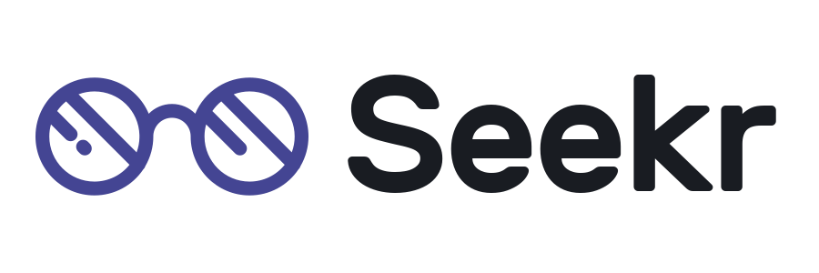
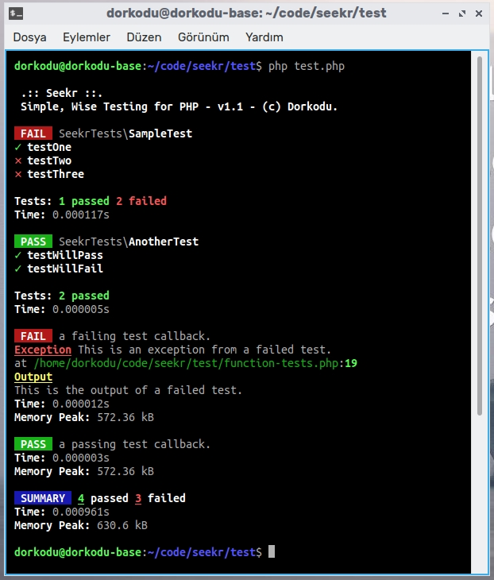
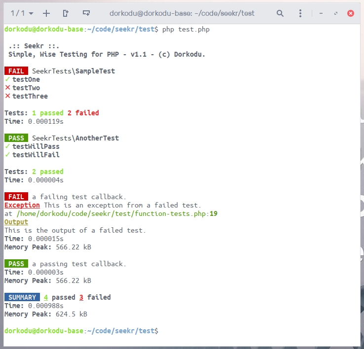

<p align="center" style="text-align: center;">
  
</p>

# Seekr

## What?

Seekr is an awesome testing library for writing ***better*** tests ***easily*** and ***wisely*** on ***PHP***. <br>Seekr is independent from any framework. So anyone can use it.

## Why?

Because I found the strict, formal TDD way and other test frameworks *a little hard and not approachable* by beginners. Developing a new way *minimalist* library sound much easier and made sense to me. I sat down and re-thought the philosophy behind testing. And decided on the core values to provide by testing. The result is better for small and medium size projects.

So, instead of spending days to figure out **configuration, test integration, writing tests and being able to see organized results**; I created this simple but awesome PHP testing library to write ***wisely, accurate, efficient*** tests.

## How?

Simple. There are *two* different testing approaches, use which way is appropriate for your code.

1. ***You can write single function tests, by giving a callback and a description***
2. ***You can write test classes using TestCase***<br>Create a class for your tests. Extend *TestCase*.<br>Write test methods and start their name with *'test'*, like **testFoo**, **testBar** etc.<br>Then create an instance of that class. Add it to your TestRepository.<br>You are ready to go!

If you want to see beautiful results, we dictate using console with *PHP CLI* from Terminal.

If your test function (and *TestCase* method) throws an exception, it is considered failing.<br>Otherwise it passes.

**`Seekr::run()`** to run tests. <br>This will run each of your test methods & functions and create a TestResult for each. <br>These result objects are stored in Seekr’s private static property. <br>

There are a few more advanced features of Seekr. <br>If you like it, you can take a look on them too :)

### Here is a sample :

- #### Create your test class. 

  Test method names must start with "**test**" and be longer than 4 characters, so you can’t name your test methods as **“test”**. When they throw an exception, Seekr will handle it automaticly :)
  
  **SampleTest.php**
  
  ```php
  <?php
  
  namespace SeekrTests;
  
  use Exception;
  use Dorkodu\Seekr\Test\TestCase;
  
  /**
   * A simple Test class with a few tests
   */
  class SampleTest extends TestCase
  {
    /**
     * An empty test will pass
     */
    public function testOne()
    {
    }
  
    /**
     * This test will pass
     */
    public function testTwo()
    {
      echo "This test just prints something. So will pass.";
    }
  
    /**
     * This test will fail
     */
    public function testThree()
    {
      echo "This is the output from a failed test";
      throw new Exception("This is an exception from a failed test.");
    }
  }
  
  ```
  
- #### Create your test functions

  *A test function* **=** *description* **+** *callback*

  **function-tests.php**

  ```php
  <?php
  
  /**
   * We used Loom dependency utility for autoloading, 
   * but you probably use Composer. Doesn't matter :)
   */
  require "loot/loom-weaver.php";
  
  use Dorkodu\Seekr\Seekr;
  
  /**
   * You can also write functional tests 
   * by giving a description and a callback 
   */
  Seekr::test("a failing test callback.", function () {
    echo "This is the output of a failed test.";
    throw new Exception("This is an exception from a failed test.");
  });
  
  Seekr::test("a passing test callback.", function () {
    echo "This test will pass :)";
  });
  
  ```

- #### **Run your tests.**

  We suggest you to write a single endpoint file for adding your tests and running them with Seekr, but you should define them somewhere else, just for the sake of managebility. It’s just a best-practice. 

  **Here is a sample entry file for Seekr :**

  **test.php**

  ```php
  <?php
  
  /**
   * We used Loom utility for autoloading,
   * but you probably use Composer. It doesn't matter :)
   */
  require "loot/loom-weaver.php";
  
  # these are the test files
  require_once "SampleTest.php";
  require_once "AnotherTest.php";
  
  use Dorkodu\Seekr\Seekr;
  use SeekrTests\SampleTest;
  use SeekrTests\AnotherTest;
  
  # You can add a test case class by giving an instance of it.
  Seekr::testCase(new SampleTest());
  Seekr::testCase(new AnotherTest());
  
  # Run Seekr
  Seekr::run();
  ```
  
  Get the execution result in output, looks better if you use CLI.
  
  - Each *TestCase*‘s passing state is determined by all of the test methods it contains.<br>
  
  - When an exception occurs, your test is considered *failing*.<br>Seekr will show both *exception message and output.* <br>Also for every test Seekr tells the execution time in seconds and the peak memory usage.
  
      #### Results on a dark-theme terminal :

  

  #### Results on a light-theme terminal :

  

## Advanced Use

### Settings

There are some settings you can set while using Seekr.<br>We wanted to give you customization chance we actually wanted.

- **`hideResults` :**  Will only show the summary.<br>Set to boolean, default : *false*
- **`hideHeader` :** Won’t show the header (Seekr brand and copyright statement on Terminal).<br>For real minimalists, anti-distraction made simpler :)<br>Set to boolean, default : *false*
- **`detailed` :** Will show details such as time and memory on TestCase method results. <br>Set to boolean, default : *false*

```php
...
/*
 * Give settings array to run method. Each is optional. 
 * Seekr works even if you don't set any of them.
 */
Seekr::run([
  'detailed' => true,
  'hideHeader' => true
]);
```

### Custom Test Repository

You can group your test cases and functions based on their domains/namespaces, by using `TestRepository`. Seekr has a default *TestRepository*, if you don’t

```php
<?php
  
$testRepository = new TestRepository();

$testRepository->case(new SampleTest());
$testRepository->function(new TestFunction("name", function() {}));

# You can add a test case class by giving an instance of it.
Seekr::testCase(new SampleTest());
Seekr::testCase(new AnotherTest());

# Run Seekr
Seekr::run();
```

### Hooks

You can use life cycle hooks to catch up with execution steps of tests.

These are current life cycle hooks for a test environment:

- `setUp()` **:**  Called *before* starting to run tests in a test class
- `finish()` **:** Called *after all* tests in a test class have run
- `mountedTest()` **:** Called *before each* test of this test class is run
- `unmountedTest()` **:** Called *after each* test of this test class is run.

```php
class SampleTest extends TestCase 
{
  /**
	 * This is how to use a hook. For this we use setUp(),
	 * which will be run before starting to run tests.
   */ 
  public function setUp()
  {
    echo "This is the setUp hook!";
  }
...
```

## Author

**Doruk Eray :** [GitHub](https://github.com/dorukeray)  | [Twitter](https://twitter.com/doruk4ever) | [doruk@dorkodu.com](mailto:doruk@dorkodu.com) | [doruk.dorkodu.com](https://dorkodu.com)

See also the list of [contributions](https://libre.dorkodu.com) that we are making at [Dorkodu](https://dorkodu.com) to the free software community.

## License

Seekr is open-sourced software licensed under the [MIT license](LICENSE).

