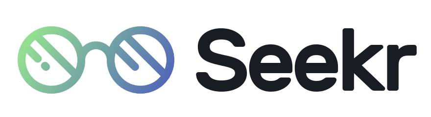

# Seekr

## What?

Seekr is a simple testing library that is for writing better tests easily and wisely on PHP. <br>Seekr is independent from any ecosystem or framework. So anyone can use it in their code.

## Why?

Because I found TDD a little hard. Behavior Driven Development sound much easier and made sense to me. <br>So, instead of spending days to figure out **how to write tests**, **how to integrate them with my existing code**, **how to set up a "build pipeline" ;** I created a simple and minimalistic PHP testing library to write more ***wisely, accurate, efficient*** tests in my code.

## How?

Simple. There are two different methods.

1. You can write single callback tests 
2. You can write test classes using *TestCase*<br>Create a class for your tests. Extend *TestCase*.<br>Write test methods and start their name with 'test', like **testFoo**, **testBar** etc.<br>Then create an instance of that class. Add it to your TestRepository instance.<br>You are ready to go!

If you want to see beautified results, we recommend using PHP CLI.

Write  `Seekr::run()` to run tests. <br>This will run each of your test methods & functions and create a TestResult for each. <br>These result objects are stored in Seekr's `static::$log` property. <br>Use  `Seekr::seeResults()` to see your results on CLI<br>

There are a few advanced features of Seekr. <br>If you like it, you can take a look on them too :smile:

### **It has a few components :**

- **Seekr :** The base for testable classes. Any class that extends Seekr, gets access to helper testing methods.
- **TestRepository :** The base for testable classes. Any class that extends Seekr, gets access to helper testing methods.
- **TestCase :** The base for testable classes. Any class that extends *TestCase*, can be used as as a test class.
- **Say :** Provides useful assertions for Seekr tests. Optional to use.
- **TestResult :** An object for representing test results. This can be logged, inspected and tracked. <br>Useful abstraction :)
- **Premise :** With that, everyone can create their own premises using `Premise::propose()`. <br>A premise throws a Contradiction in case that statement is evaluated and is equal to false.<br>This is considered an exception and Seekr marks this test as a failure. Otherwise it is succeed.
- **Contradiction :** An object for representing `Premise` exceptions.

### Here is a sample :

- Create your test class. Test method names must start with "**test**". <br>When they throw an exception, Seekr will handle it :)

  ```php
  <?php
    
  use Dorkodu\Seekr\Test\TestCase;
  
  /**
   * A simple Test class with a few tests
   */
  class SampleTest extends TestCase
  {
    /**
     * This test is empty
     */
    public function testEmpty()
    {
    }
  
    /**
     * This test is designed to pass
     */
    public function testOne()
    {
      echo "hello";
    }
  
    /**
     * This test is designed to fail
     */
    public function testTwo()
    {
      throw new Exception("Unknown Exception", 1);
    }
  }
  
  ```
  
- **Run your tests.**<br>We suggest you to write a single endpoint file for adding your tests and running them with Seekr, but you should define them somewhere else, just for the sake of managebility. 

  **Here is an example :**

  ```php
  <?php
  /**
   * We used Loom dependency utility for autoloading, 
   * but you probably use Composer. Doesn't matter :)
   */ 
  require "loot/loom-weaver.php";
  
  # this is the test file
  require_once "SampleTest.php";
  
  use Dorkodu\Seekr\Seekr;
  use Joke\SampleTest;
  
  # You can add a test case class by giving an instance of it.
  Seekr::testCase(new SampleTest());
  
  # You can also write functional tests by giving a description and a callback 
  Seekr::test("a simple test callback.", function () {
    throw new Exception("This is an exception by");
  });
  
  # Run Seekr
  Seekr::run();
  ```

- Get the execution result in output, looks better if you use CLI

  ```bash
  
  ```

### Advanced :

#### Hooks

You can implement life cycle hooks to catch up with execution steps of tests :<br>These are current life cycle hooks for a test environment :

- `setUp()` :  Called *before* starting to run tests in a test class
- `finish()` : Called *after all* tests in a test class have run
- `mountedTest()` : Called *before each* test of this test class is run
- `unmountedTest()` : Called *after each* test of this test class is run.

```php
class SampleTest extends TestCase 
{
  /**
	 * This is how to use a hook. For this we use setUp(),
	 * which will be run before starting to run tests.
   */ 
  public function setUp()
  {
    echo "This is the setUp hook!";
  }
```

## Author

Doruk Dorkodu : [GitHub](https://github.com/dorukdorkodu)  | [Twitter](https://twitter.com/dorukdorkodu) | [doruk@dorkodu.com](mailto:doruk@dorkodu.com) | [dorkodu.com](https://dorkodu.com)

See also the list of [contributions](https://libre.dorkodu.com) that we are making at [Dorkodu](dorkodu.com) to the free software community.

## License

Seekr is open-sourced software licensed under the [MIT license](LICENSE).

